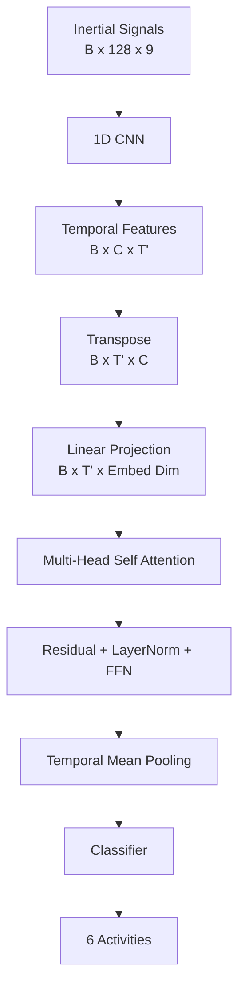

# Multi-Head Attention Optimization for Human Activity Recognition

## Overview

This project studies how **Multi-Head Attention (MHA)** configuration affects multivariate time-series classification on the **UCI Human Activity Recognition Using Smartphones (UCI HAR)** dataset.

The experiment compares a compact 1D CNN baseline with CNN + MHA models and uses Optuna to optimize the attention architecture. The goal is not to assume that attention is better, but to measure performance and computational trade-offs experimentally.

## Problem

The task is six-class Human Activity Recognition:

- Walking
- Walking Upstairs
- Walking Downstairs
- Sitting
- Standing
- Laying

The project uses only the temporal files under `Inertial Signals/`, never the 561 engineered features in `X_train.txt` or `X_test.txt`.

Each sample contains 128 time steps and nine channels:

- `body_acc_x/y/z`
- `body_gyro_x/y/z`
- `total_acc_x/y/z`

Therefore, the model input is `[B, 128, 9]`.

Dataset: UCI Machine Learning Repository, HAR Using Smartphones, DOI `10.24432/C54S4K`.

## Architecture



The baseline stops after the CNN and uses global average pooling plus a classifier.

## Data split and preprocessing

The official UCI HAR train/test split is preserved. Validation is extracted only from the official training set using **subject-disjoint splitting** with `subject_train.txt`.

Normalization statistics are calculated from the final training subset only and then reused for validation and test data.

## Experiments

1. **CNN baseline**
2. **CNN + fixed MHA** (`embed_dim=128`, `heads=4` by default)
3. **CNN + optimized MHA** with Optuna
4. **Head ablation:** 1, 2, 4 and 8 attention heads with the remaining fixed-model settings held constant

The main optimization metric is **validation Macro F1**.

## Installation

```bash
python -m venv .venv
```

Activate the environment and install dependencies:

```bash
pip install -r requirements.txt
```

Download the official dataset:

```bash
python scripts/download_data.py
```

## Usage

Run from the project root:

```bash
python scripts/train_baseline.py
python scripts/train_attention.py
python scripts/optimize.py
python scripts/evaluate.py
```

For a quicker local Optuna run, reduce `optimization.n_trials` and `optimization.epochs_per_trial` in `config/config.yaml`.

## Optimization

Optuna explores a deliberately compact search space:

- `embed_dim`: 32, 64, 128, 256
- `num_heads`: 1, 2, 4, 8
- `num_attention_layers`: 1 to 3
- attention/classifier dropout
- learning rate
- CNN channels and kernel size
- feed-forward dimension

The implementation guarantees `embed_dim % num_heads == 0`.

## Metrics and outputs

The project records:

- Accuracy
- Macro Precision
- Macro Recall
- Macro F1
- Confusion matrix
- Classification report
- Train time
- Mean epoch time
- Inference time per sample
- Number of trainable parameters

Generated files include:

```text
results/
├── metrics.json
├── experiments.csv
├── *_confusion_matrix.png
├── *_training_curves.png
├── heads_comparison.png
├── f1_by_architecture.png
├── attention_distribution.png
└── optuna_history.png
```

No result values are hard-coded; these files are produced from actual runs.

## Project structure

```text
mha-human-activity-recognition/
├── config/config.yaml
├── data/README.md
├── src/
│   ├── dataset.py
│   ├── models.py
│   ├── trainer.py
│   ├── metrics.py
│   ├── optimization.py
│   ├── visualization.py
│   └── utils.py
├── scripts/
│   ├── download_data.py
│   ├── train_baseline.py
│   ├── train_attention.py
│   ├── optimize.py
│   └── evaluate.py
├── tests/
├── checkpoints/
├── results/
└── requirements.txt
```

## What the MHA receives

The dimensional flow for the default CNN is:

```text
[B, 128, 9]
      ↓ transpose inside CNN
[B, 9, 128]
      ↓ Conv1D + pooling
[B, C, 32]
      ↓ transpose
[B, 32, C]
      ↓ linear projection
[B, 32, embed_dim]
      ↓ self-attention
[B, 32, embed_dim]
      ↓ temporal mean pooling
[B, embed_dim]
      ↓ classifier
[B, 6]
```

In self-attention, the same temporal representation supplies Query, Key and Value. Each head operates on a subspace of the embedding and the resulting head representations are combined by PyTorch's `nn.MultiheadAttention`.

Attention maps are exported only for exploratory inspection. They are not treated as definitive causal explanations of model behavior.

## Tests

```bash
pytest -q
```

The tests cover inertial-signal loading, `[N, 128, 9]` shape, normalization, CNN forward propagation, CNN-to-attention dimensional transformation, different head counts and the complete CNN+MHA forward pass.

## Conclusion

The repository intentionally does not claim that MHA improves HAR before experimentation. After running all scripts, `results/experiments.csv` provides the evidence needed to answer whether the optimized attention architecture improved Macro F1 enough to justify its extra parameters, training time and inference cost.
